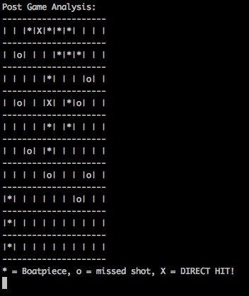

# Stripped-down battleship
The devs of an indie game studio decided to strip down their beautiful multiplatform battleship-game to an end scenario analysis tool.

During a party, they got a json-file from the end result of the latest played game. During the early hours, they built a tool that outputs the state based on this json-file.

Because they had done the programming during the early hours, they didn't understand the code anymore in the morning. They had to refactor the code.

# Assignment
The code in the application is bad. Your task is to refactor the application so that it is better. There are no right or wrong answers. Refactor the code so that it looks like something you could present as your own code. 

The goal is to get the same end result that is presented in the endresult.png -image. The input is the battlezone.json -file.

Here's how the endresult.png looks like:

# What you need
The project is a .NET Core project so you'll need a .NET Core development environment ( https://www.microsoft.com/net/core ). 

You can use any libraries and tools that you see fit.